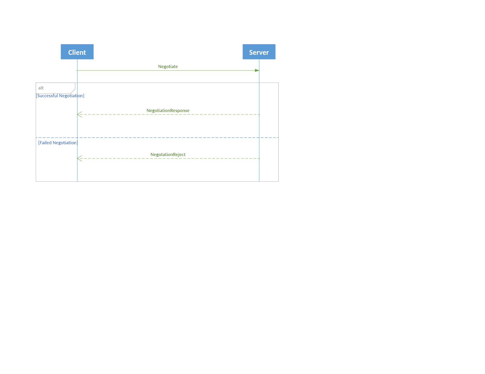
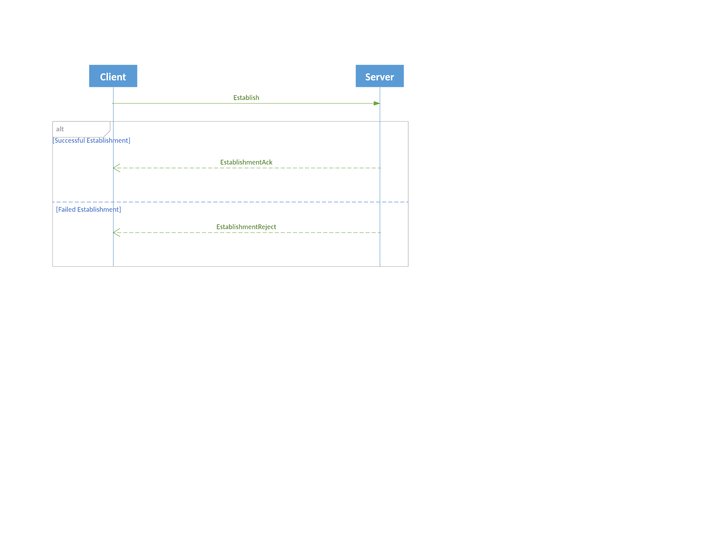
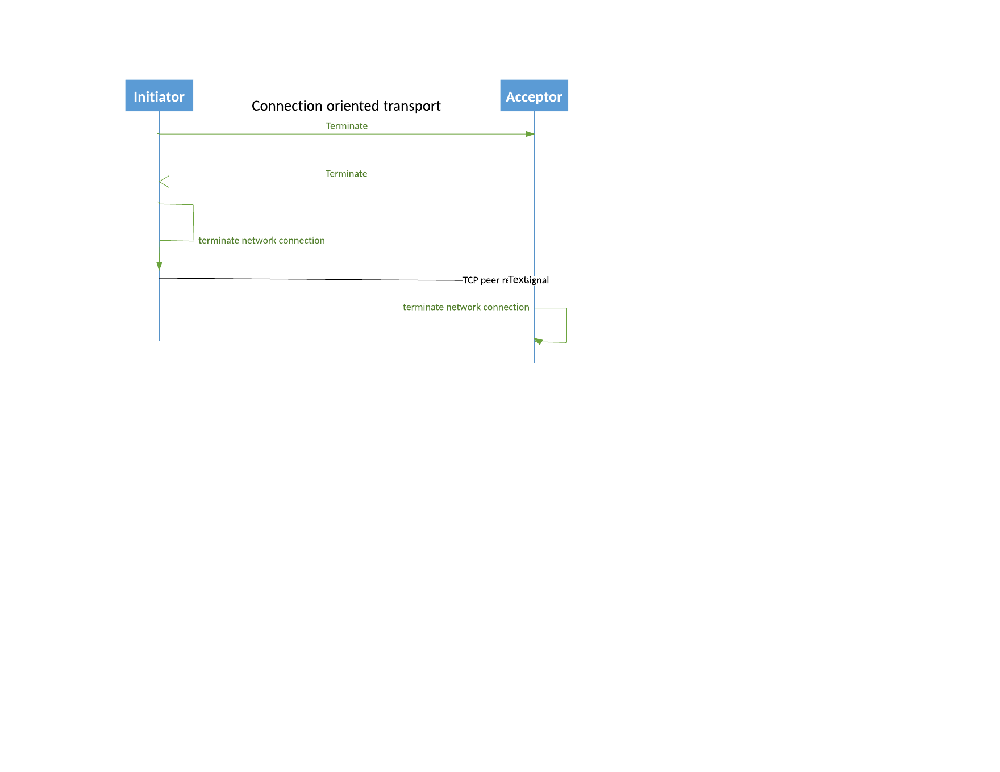
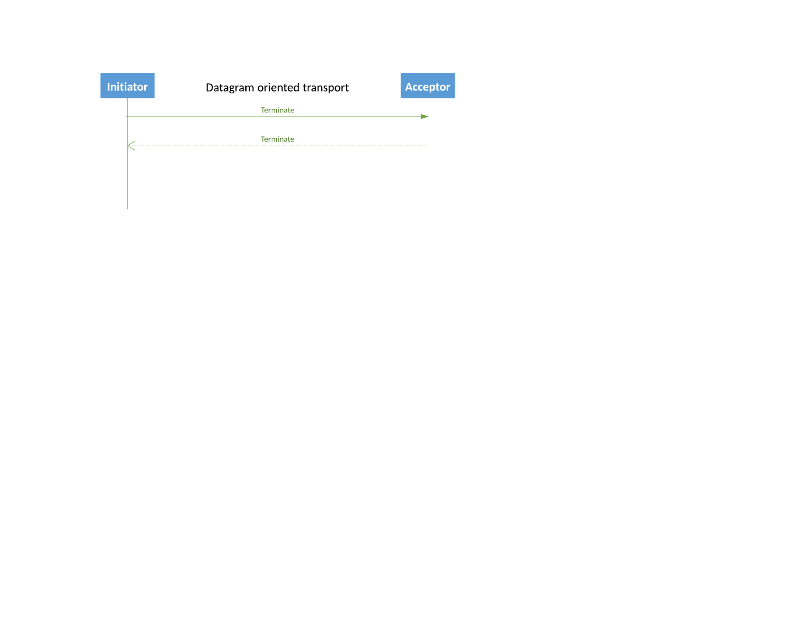
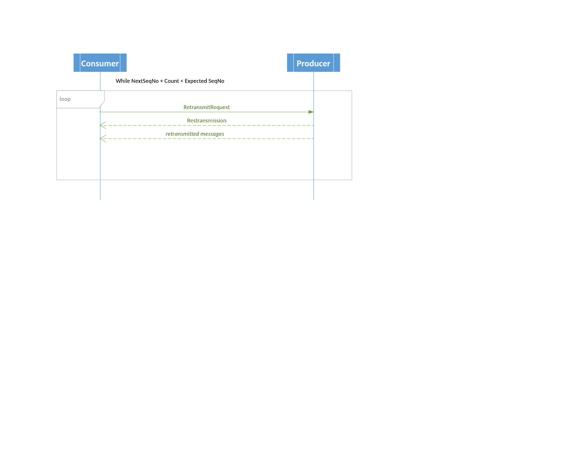
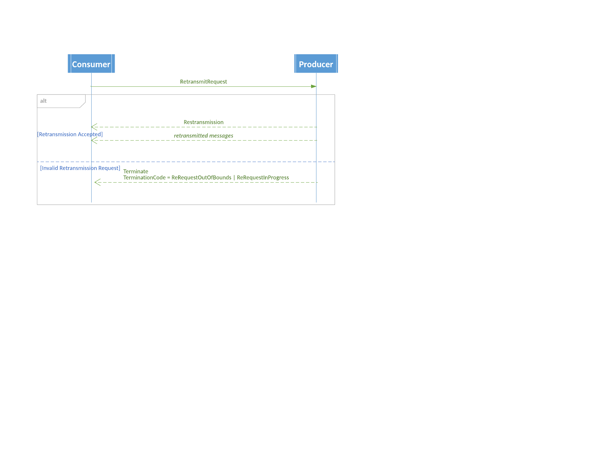
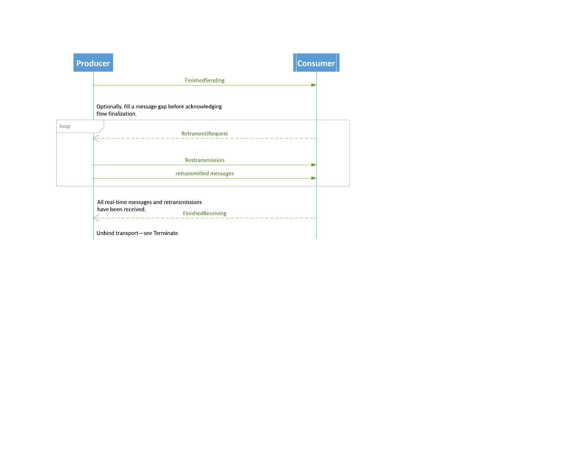
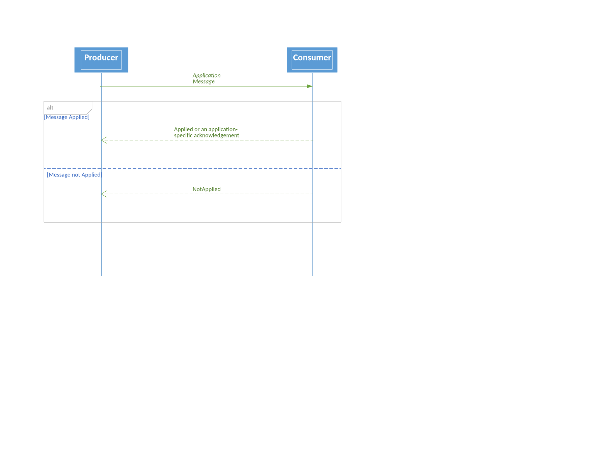

Point-to-Point Session Protocol
===============================

A point-to-point session between a client and server must be conducted over a bidirectional transport, such as TCP or UDP unicast. Point-to-point protocol is designed for private flows of information between organizations. Optionally, multiple sessions belonging to an organization may be multiplexed over a shared transport.

Summary of Messages that Control Lifetime
-----------------------------------------

A logical session must be created by using a Negotiation message. The session ID must be sent in the Negotiation message and that ID is used for the lifetime of the session.

After negotiation is complete, the client must send an Establish message to reach the established state. Once established, exchange of application messages may proceed. The established state is concurrent with the lifetime of a connection-oriented transport such as TCP. A client may re-establish a previous session after reconnecting without any further negotiation. Thus, Establish binds the session to the new transport instance.

To signal a counterparty that a disconnection is about to occur, a Terminate message should be sent. This unbinds the transport from the session, but it does not end a logical session.

A session that has a recoverable flow may be re-established by sending Establish with the same session ID, and an exchange of messages may continue until all business transactions are finished.

A logical session should be ended by sending a FinishedSending message. Thereafter, no more application messages should be sent. The counterparty must respond with FinishedReceiving when it has processed the last message, and then the transport must be terminated for the final time for that session. Once a flow is finalized and the transport is unbound, a session ID is no longer valid and messages previously sent on that session are no longer recoverable.

Session Initiation and Negotiation
----------------------------------

A negotiation dialog is provided to support a session negotiation protocol that is used for a client to declare what id it will be using, without having to go out of band. There is no concept of resetting a session. Instead of starting over a session, a new session is negotiated - a SessionId in UUID form is cheap.

The optional session negotiation is expected to occur at session initiation.

### Flow Type

The negotiation protocol identifies the types of message flow in each direction of a session.

FlowType = Recoverable | Unsequenced | Idempotent | None 

From highest to lowest delivery guarantee, the flow types are:

-   **Recoverable**: Guarantees exactly-once message delivery. If gaps are detected, then missed messages may be recovered by retransmission.

-   **Idempotent**: Guarantees at-most-once delivery. If gaps are detected, the sender is notified, but recovery is under control of the application, if it is done at all.

-   **Unsequenced**: Makes no delivery guarantees (best-effort). This choice is appropriate if guarantees are unnecessary or if recovery is provided at the application layer or through a different communication channel.

-   **None**: No application messages should be sent in one direction of a session. If ClientFlow is None, then application messages flow only from server to client.

By agreement between counterparties, only certain of these flow types may be supported for a particular service.

### Initiate Session Negotiation

Negotiate message is sent from client to server.

**Negotiate**

| **Field name** | **Type**      | **Required** | **Value** | **Description**                                                                                                      |
|----------------|---------------|--------------|-----------|----------------------------------------------------------------------------------------------------------------------|
| MessageType    | Enum          | Y            | Negotiate |                                                                                                                      |
| SessionId      | UUID          | Y            |           | Session Identifier                                                                                                   |
| Timestamp      | nanotime      | Y            |           | Time of request                                                                                                      |
| ClientFlow     | FlowType Enum | Y            |           | Type of flow from client to server                                                                                   |
| Credentials    | Object        | N            |           | Optional credentials to identify the client. Format to be determined by agreement between counterparties. |

### Accept Session Negotiation

When a session is accepted by a server, it must send a NegotiationResponse in response to a Negotiate message.

To support mutual authentication, a server may return a Credentials field to the NegotiationResponse message. It conveys identification of the server back to the client. As for the Credentials field in the Negotiate message, the format should be determined by agreement of counterparties.

**NegotiationResponse**

| **Field name**   | **Type**      | **Required** | **Value**           | **Description**                    |
|------------------|---------------|--------------|---------------------|------------------------------------|
| MessageType      | Enum          | Y            | NegotiationResponse |                                    |
| SessionId        | UUID          | Y            |                     | Session Identifier                 |
| RequestTimestamp | nanotime      | Y            |                     | Matches Negotiate.Timestamp        |
| ServerFlow       | FlowType Enum | Y            |                     | Type of flow from server to client |
| Credentials    | Object        | N            |           | Optional credentials to identify the server. Format to be determined by agreement between counterparties. |

### Reject Session Negotiation

When a session cannot be created, a server must send NegotiationReject to the client, giving the reason for the rejection. No further messages should be sent, and the transport should be terminated.
 
NegotiationRejectCode = Credentials | Unspecified | FlowTypeNotSupported | DuplicateId 

Rejection reasons:

-   Credentials: failed authentication because identity is not recognized, or the user is not authorized to use a particular service.

-   FlowTypeNotSupported: server does not support requested client flow type.

-   DuplicateId: session ID is non-unique.

-   Unspecified: Any other reason that the server cannot create a session.

If negotiation is re-attempted after rejection, a new session ID should be generated.

**NegotiationReject**

| **Field name**   | **Type**                   | **Required** | **Value**         | **Description**             |
|------------------|----------------------------|--------------|-------------------|-----------------------------|
| MessageType      | Enum                       | Y            | NegotiationReject |                             |
| SessionId        | UUID                       | Y            |                   | Session Identifier          |
| RequestTimestamp | nanotime                   | Y            |                   | Matches Negotiate.Timestamp |
| Code             | NegotiationRejectCode Enum | Y            |                   |                             |
| Reason           | string                     | N            |                   | Reject reason details       |

###  Session Negotiation Sequence Diagram

Session Establishment
---------------------

Establish attempts to bind the specified logical session to the transport that the message is passed over. The response to Establish is either EstablishmentAck or EstablishmentReject.

### Establish

The client must send Establish message to the server and await acknowledgement.

There is no specific timeout value for the wait defined in this protocol. Experience should be a guide to determine an abnormal wait after which a server is considered unresponsive. Then establishment may be retried or out-of-band inquiry may be made to determine application readiness.

**Establish**

| **Field name**    | **Type**       | **Required** | **Value** | **Description**                                                                                                            |
|-------------------|----------------|--------------|-----------|----------------------------------------------------------------------------------------------------------------------------|
| MessageType       | Enum           | Y            | Establish |                                                                                                                            |
| SessionId         | UUID           | Y            |           | Session Identifier                                                                                                         |
| Timestamp         | nanotime       | Y            |           | Time of request                                                                                                            |
| KeepaliveInterval | DeltaMillisecs | Y            |           | The longest time in milliseconds the initiator should remain silent before sending a keep alive message                      |
| NextSeqNo         | u64            | N            |           | For re-establishment of a recoverable server flow only, the next application sequence number to be produced by the client. |
| Credentials       | object         | N            |           | Optional credentials to identify the client.                                                                               |

Counterparties may agree on a valid range for KeepaliveInterval.

The server should evaluate NextSeqNo to determine whether it missed any messages after re-establishment of a recoverable flow. If so, it may immediately send a RetransmitRequest after sending EstablishAck.

### Establish Acknowledgment

Used to indicate the acceptor acknowledges the session. If the communication flow from this endpoint is recoverable, it should fill the NextSeqNo field, allowing the initiator to start requesting the replay of messages that it has not received.

**EstablishmentAck**

| **Field name**    | **Type**       | **Required** | **Value**        | **Description**                                                                                        |
|-------------------|----------------|--------------|------------------|--------------------------------------------------------------------------------------------------------|
| MessageType       | Enum           | Y            | EstablishmentAck |                                                                                                        |
| SessionId         | UUID           | Y            |                  | SessionId is included only for robustness, as matching RequestTimestamp is enough                      |
| RequestTimestamp  | nanotime       | Y            |                  | Must match Establish.Timestamp                                                                            |
| KeepaliveInterval | DeltaMillisecs | Y            |                  | The longest time in milliseconds the acceptor should wait before sending a keep alive message            |
| NextSeqNo         | u64            | N            |                  | For a recoverable server flow only, the next application sequence number to be produced by the server. |

The client should evaluate NextSeqNo to determine whether it missed any messages after re-establishment of a recoverable flow. If so, it may immediately send a RetransmitRequest .

### Establish Reject

EstablishmentRejectCode = Unnegotiated | AlreadyEstablished | SessionBlocked | KeepaliveInterval | Credentials | Unspecified 

Rejection reasons:

-   Unnegotiated: Establish request was not preceded by a Negotiation or session was finalized, requiring renegotiation.

-   AlreadyEstablished: EstablishmentAck was already sent; Establish was redundant.

-   SessionBlocked: user is not authorized

-   KeepaliveInterval: value is out of accepted range.

-   Credentials: failed because identity is not recognized, or the user is not authorized to use a particular service.

-   Unspecified: Any other reason that the server cannot establish a session.

**EstablishmentReject**

| **Field name**   | **Type**                     | **Required** | **Value**           | **Description**                                         |
|------------------|------------------------------|--------------|---------------------|---------------------------------------------------------|
| MessageType      | Enum                         | Y            | EstablishmentReject |                                                         |
| SessionId        | UUID                         | Y            |                     | SessionId is redundant and included only for robustness |
| RequestTimestamp | nanotime                     | Y            |                     | Must match Establish.Timestamp                             |
| Code             | EstablishmentRejectCode Enum | Y            |                     |                                                         |
| Reason           | string                       | N            |                     | Reject reason details                                   |

### Session Establishment Sequence Diagram

Transport Termination
---------------------

Terminate is a signal to the counterparty that this side is dropping the binding between the logical session and the underlying transport. A session may terminate its transport if there are no more messages to send but it intends to restart at a later time.

An established session becomes terminated (stops being established) for the following reasons:

-   One of the peers receives a Terminate message.

-   The transport was abruptly disconnected.

-   The keep-alive interval expired and no keep-alive message received. It is recommended to allow some leniency in timeout to allow for slight mismatches of timers between parties.

-   The peer violated this protocol. A specific example of protocol violation is to send a RetransmitRequest while another one is in progress.

-   Additionally, a transport should be terminated if an unrecoverable error occurs in message parsing or framing.

TerminationCode = Finished | UnspecifiedError | ReRequestOutOfBounds | ReRequestInProgress 

**Terminate**

| **Field name** | **Type**             | **Required** | **Value** | **Description**                                         |
|----------------|----------------------|--------------|-----------|---------------------------------------------------------|
| MessageType    | Enum                 | Y            | Terminate |                                                         |
| SessionId      | UUID                 | Y            |           | SessionId is redundant and included only for robustness |
| Code           | TerminationCode Enum | Y            |           |                                                         |
| Reason         | string               | N            |           | Reject reason details                                   |

### Terminate Response

On a point-to-point session, either peer may initiate termination. Upon receiving a Terminate message, the acceptor must respond to the initiator with a Terminate message before disconnecting the transport.

On a connectionless transport such as UDP, the Terminate message informs the peer that message exchange is suspended.

On a connection-oriented transport such as TCP, when the initiator receives the Terminate response, it must disconnect the transport from its end. When the acceptor receives the TCP peer reset signal, it completes closing of the transport.

### Terminate Session Sequence Diagrams

Session Heartbeat
-----------------

Each party must send a heartbeat message during each interval in which no application messages were sent. A client's heartbeat timing is governed by the KeepaliveInterval value it sent in the Establish message, and a server is governed by the value it sent in EstablishAck.

Each party should check whether it has received any message from its counterparty in the expected interval. Silence is taken as evidence that the transport is no longer valid, and the session should be terminated in that event.

For recoverable or idempotent flows, the gap detection should be achieved by sending Sequence messages respecting the keepalive interval.

For Unsequenced and None (one-way session) flows, there is the UnsequencedHeartbeat message to detect that a logical session has disappeared or that there is a problem with the transport, allowing the peer to terminate session state timely and to potentially reestablish the session.

**UnsequencedHeartbeat**

| **Field name** | **Type** | **Required** | **Value**            | **Description** |
|----------------|----------|--------------|----------------------|-----------------|
| MessageType    | Enum     | Y            | UnsequencedHeartbeat |                 |

When a session is being finalized, but the FinishedReceiving message has not yet been received, then FinishedSending message must be used as the heartbeat.

On TCP, it is recommended that Nagle algorithm be disabled to prevent the transmission of heartbeats and other messages from being delayed, potentially causing unnecessary session termination.

Resynchronization
-----------------

The following sections describe resynchronization of a recoverable flow.

### Retransmission Request

When receiving a recoverable message flow, a peer may request sequenced messages to be retransmitted by sending a *RetransmitRequest* message, which should be answered by one or more *Retransmission* messages (or with a *Terminate* message if the request is invalid).

Only one RetransmitRequest is allowed in-flight at a time per session. Another RetransmitRequest must not be sent until a response has been received from a previous request.

The receiver on a recoverable flow should accept messages with a higher sequence number after recognizing a gap. However, the application should queue messages for in-sequence processing after a requested retransmission is received.

Sending a RetransmitRequest to the sender of an Idempotent ,Unsequenced or None flow is a protocol violation. In that case, the session must be terminated.

**RestransmitRequest**

| **Field name** | **Type** | **Required** | **Value**          | **Description**                                      |
|----------------|----------|--------------|--------------------|------------------------------------------------------|
| MessageType    | Enum     | Y            | RestransmitRequest |                                                      |
| SessionId      | UUID     | Y            |                    |                                                      |
| Timestamp      | nanotime | Y            |                    | Timestamp used as a unique identifier of the request |
| FromSeqNo      | u64      | Y            |                    | Sequence number of the first message requested       |
| Count          | u32      | Y            |                    | Count of messages requested                          |

### Retransmission Responses

*Retransmission* implies that the subsequent messages are sequenced without requiring that a Sequence message is passed. In a datagram oriented transport, Retransmission is passed in every single retransmission datagram.

**Restransmission**

| **Field name**   | **Type** | **Required** | **Value**       | **Description**                                                                    |
|------------------|----------|--------------|-----------------|------------------------------------------------------------------------------------|
| MessageType      | Enum     | Y            | Restransmission |                                                                                    |
| SessionId        | UUID     | Y            |                 | Defeats the need for Context when multiplexing                                     |
| RequestTimestamp | nanotime | Y            |                 | Value from RetransmitRequest Timestamp field. Used to match responses to requests. |
| NextSeqNo        | u64      | Y            |                 | Sequence number of the next message to be retransmitted                            |
| Count            | u32      | Y            |                 | Count of messages to be retransmitted in a batch                                   |

#### Retransmission Diagram

#### Interleaving and Pacing Retransmissions

This protocol does *not* require real-time messages to be held by the sender until retransmission of a range of messages is complete. Rather, ranges of retransmitted and real-time messages may be interleaved. Each time some messages are retransmitted, they must be preceded by a Retransmission message with a count of messages. Each time real-time flow resumes, a Sequence message (or Context message on a multiplexed flow) must be sent.

The provider of a recoverable flow need not retransmit all requested messages in a single batch. Rather, retransmission should be executed as an iterative process. It is the requester's responsibility to determine whether the current batch fills the original gap. If not, it should send another RetransmitRequest for the remainder. Requests and responses should proceed iteratively until all desired messages have been retransmitted. This interaction automatically paces the retransmission flow while allowing real-time messages to flow through uninhibited.

Pacing is the responsibility of the retransmitter. It is managed by controlling the size of batches of retransmitted messages. To maximize interleaving with real-time messages without queuing, it is recommended that messages be retransmitted in small batches. Optimally, a batch should not exceed to the size of a datagram, even on a TCP stream.

However, when retransmission is provided through a separate recovery session without interleaving real-time messages, then the retransmitter may choose to fulfill requests in a single batch.

#### Retransmit Rejection

If the provider of a recoverable flow is unable to retransmit requested messages, it responds with a RetransmitReject message.

RetransmitRejectCode = OutOfRange | InvalidSession | RequestLimitExceeded 

Rejection reasons:

-   OutOfRange : NextSeqNo + Count is beyond the range of sequence numbers

-   InvalidSession: The specified SessionId is unknown or is not authorized for the requester to access.

-   RequestLimiitExceeded : The message Count exceeds a local rule for maximum retransmission size.

**RestransmitReject**

| **Field name**   | **Type**                  | **Required** | **Value**         | **Description**                                                                    |
|------------------|---------------------------|--------------|-------------------|------------------------------------------------------------------------------------|
| MessageType      | Enum                      | Y            | RestransmitReject |                                                                                    |
| SessionId        | UUID                      | Y            |                   | Session identifier                                                                 |
| RequestTimestamp | nanotime                  | Y            |                   | Value from RetransmitRequest Timestamp field. Used to match responses to requests. |
| Code             | RetransmitRejectCode Enum | Y            |                   |                                                                                    |
| Reason           | string                    | N            |                   | Reject reason details                                                              |

### RetransmitReject Diagram

### Retransmission Violations

For a RetransmitRequest that the requester should have known was invalid with certainty, the sender should terminate the session. Terminate message with **ReRequestInProgress** code should be sent if it sees a premature retransmit request.

### Retransmit Violation Diagram

### FIX Application Layer Recovery

As an alternative to a FIXP recoverable flow, application layer sequencing and recovery may be used. To avoid duplication of effort in two layers of the protocol stack, application layer sequencing should be used with a FIXP Unsequenced flow.

See FIX application specifications for a description of the ApplicationSequenceControl group and these message types:

-   ApplicationMessageReport

-   ApplicationMessageRequest

-   ApplicationMessageRequestAck

Finalizing a Session
--------------------

Finalization is a handshake that ends a logical session when there are no more messages to exchange.

### Finish Sending

A FinishedSending message should be sent to begin finalizing a logical session when the last application message in a flow has been sent.

The sender of this message awaits a FinishedReceiving response. It the wait takes longer than KeepaliveInterval for the flow, it should send FinishedSending messages as heartbeats until finalization is complete.

**FinishedSending**

| **Field name** | **Type** | **Required** | **Value**       | **Description**                                         |
|----------------|----------|--------------|-----------------|---------------------------------------------------------|
| MessageType    | Enum     | Y            | FinishedSending |                                                         |
| SessionId      | UUID     | Y            |                 | SessionId is redundant and included only for robustness |
| LastSeqNo      | u64      | N            |                 | Must be populated for an idempotent or recoverable flow         |

The counterparty should evaluate LastSeqNo to determine whether it has processed the flow to the end. If received on a recoverable flow, the counterparty may send a RetransmitRequest to recover any missed messages before acknowledging finalization of the flow. On an idempotent flow, it should send NotApplied to notify the sender of the gap.

### Finish Receiving

Upon processing the last application message indicated by the FinishedSending message (possibly received on a retransmission), a FinishedReceving message must be sent in response.

When a FinishedReceiving has been received by the party that initiated the finalization handshake, a Terminate message should sent to unbind the transport. At that point, the session is considered finalized, and its session ID is no longer valid.

**FinishedReceiving**

| **Field name** | **Type** | **Required** | **Value**         | **Description**                                         |
|----------------|----------|--------------|-------------------|---------------------------------------------------------|
| MessageType    | Enum     | Y            | FinishedReceiving |                                                         |
| SessionId      | UUID     | Y            |                   | SessionId is redundant and included only for robustness |

### Terminating a Recoverable Session Sequence Diagram

Idempotent Flow
---------------

When using the idempotent flow, the protocol ensures that each application message is an idempotent operation that will be guaranteed to be applied only once.

To guarantee idempotence, a unique sequential identifier msut be allocated to each operation to be carried out. The response flow must identify which operations have been carried out, and is sequenced. The lack of acknowledgment of an operation should trigger the operation to be reattempted (at least once semantics). The lack of acknowledgment should be triggered by the acknowledgment of a later operation or by the expiration of a timer. The side carrying out an operation must filter out operations with a duplicate identifier (at most once semantics). If a transaction has already been applied, a duplicate request should be silently dropped. The combination of at-most-once and at-least-once semantics provide exactly-once semantics, making any operation tagged with a unique id to be idempotent.

The sequence number is implicit and is defined using a Sequence message. The first message after Sequence has the sequence number NextSeqNo. The same lifetime rules apply for the implicit sequence number in the idempotent flow, as for the implicit sequence number in the recoverable flow.

Unless the recoverable server return flow identifies the result of operations at the application level, implementers may opt to use the following *Applied* or *NotApplied* messages to return the status of the operation.

### Applied

This is an optional application response for non-standard messages. Standard FIX semantics provide application layer acknowledgements to requests, e.g. Execution Report in response to New Order Single. The principle is to use application specific acknowledgement messages where possible; use the Applied message where an application level acknowledgement message does not exist.

Since Applied is an application message, it will be reliably delivered if returned on a recoverable flow.

**Applied**

| **Field name** | **Type** | **Required** | **Value** | **Description**                     |
|----------------|----------|--------------|-----------|-------------------------------------|
| MessageType    | Enum     | Y            | Applied   |                                     |
| FromSeqNo      | u64      | Y            |           | The first applied sequence number   |
| Count          | u32      | Y            |           | How many messages have been applied |

### NotApplied

When a receiver on an idempotent flow recognizes a sequence number gap, it should send the NotApplied message immediately but continue to accept messages with a higher sequence number after the gap.

The sender on an idempotent flow uses the NotApplied message to discover which its requests have not been acted upon. It has a responsibility to make a decision about recovery at an application layer. It may decide to resend the transactions with new sequence numbers, to send different transactions, or to do nothing.

Like Applied, the NotApplied message is handled as an application message. That is, it consumes a sequence number.

It is recommended that the return flow of an idempotent request flow be recoverable to allow Applied and NotApplied message to be resynchronized if necessary. Thus, the sender can determine with certainty (perhaps after some delay) which requests have been accepted.

Sending NotApplied for a Recoverable, Unsequenced or None flow is a protocol violation. On a recoverable flow, RetransmitRequest must be used instead.

**NotApplied**

| **Field name** | **Type** | **Required** | **Value**  | **Description**                        |
|----------------|----------|--------------|------------|----------------------------------------|
| MessageType    | Enum     | Y            | NotApplied |                                        |
| FromSeqNo      | u64      | Y            |            | The first not applied sequence number  |
| Count          | u32      | Y            |            | How many messages haven't been applied |

### Idempotent Flow Sequence Diagram

